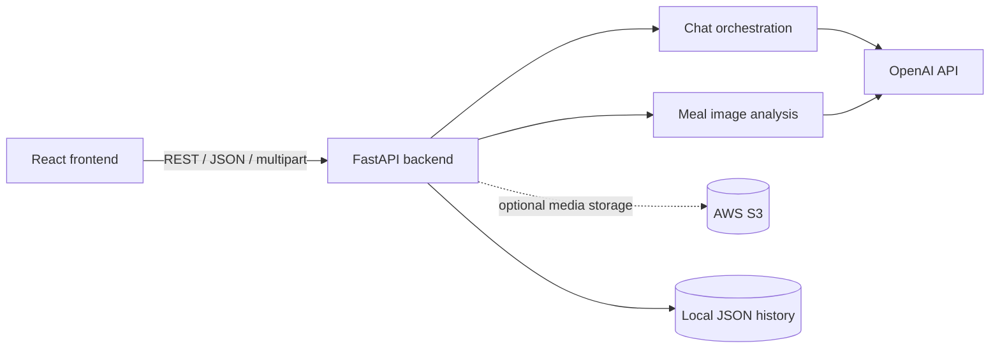

# HealthIA

> A bilingual AI wellness companion for nutrition, activity, and everyday health guidance.

<p align="center">
  <a href="https://healthia-ai.vercel.app"></a>
  <a href="./frontend_HealthIA"></a>
  <a href="./backend_HealthIA"></a>
</p>

<p align="center">
  
</p>

HealthIA is a hackathon prototype that combines a React experience with a FastAPI service to explore conversational coaching, meal-photo analysis, personalized meal plans, exercise guidance, and health-profile context. The interface supports English and Spanish copy and is designed around a mobile-first wellness journey.

> **Prototype notice:** HealthIA is an educational/product prototype, not a medical device or a substitute for professional medical advice. AI output must be reviewed by a qualified professional before any health decision.

## Live preview

The frontend is deployed on Vercel:

- **[Open HealthIA](https://healthia-ai.vercel.app)**
- The deployed preview is intentionally usable as a UI showcase. Chat and image-analysis actions require a separately hosted backend configured through `REACT_APP_API_URL`.

## What the prototype demonstrates

- 💬 Conversational health guidance with text, image, and audio request paths.
- 🍽️ Meal-photo analysis with nutritional feedback and meal history.
- 🥗 Context-aware meal plans and recipe instructions.
- 🏃 Activity, sleep, heart-rate, and wearable-device screens.
- 👤 A profile flow for goals, conditions, devices, and emergency contacts.
- 🧩 A modular API surface that keeps chat and image analysis separate.

## Screens and visual references

The following visuals come from the original HealthIA product work and pitch materials. They are kept here as a compact project gallery rather than as a replacement for the source code.

<p align="center">
  
  
  
</p>

<p align="center">
  
  
</p>

The cloud architecture image is an original design reference from the hackathon pitch. The runnable backend in this repository is the smaller FastAPI/OpenAI prototype described below; production Azure services are not assumed by the codebase.

## Architecture



### Implemented runtime

- **Frontend:** React 19, React Router, Create React App, CSS modules/stylesheets, local product assets.
- **Backend:** Python, FastAPI, Uvicorn, Pydantic models, OpenAI SDK, optional S3 media storage.
- **Persistence:** local JSON files for the prototype; S3 is optional for uploaded media.
- **Integration boundary:** `REACT_APP_API_URL` points the frontend to the FastAPI service.

### API surface

| Method | Route | Purpose |
| --- | --- | --- |
| `PUT` | `/chatbot` | Text, image, or audio conversation input. |
| `GET` | `/show-chats` | List persisted conversations. |
| `DELETE` | `/delete-chat/{chat_id}` | Remove a conversation. |
| `PUT` | `/analyze-image` | Analyze a meal image. |
| `GET` | `/list-analyses` | List image-analysis history. |
| `DELETE` | `/delete-analysis` | Remove an image analysis. |

Interactive API documentation is available at `/docs` when the backend is running locally.

## Repository layout

```text
.
├── frontend_HealthIA/       # React application and product UI
├── backend_HealthIA/        # FastAPI application and AI services
├── backend_HealthIA/app/    # Routers, models, services, and system prompt
└── frontend_HealthIA/src/   # Screens, components, assets, and styles
```

The repository intentionally contains one active Python backend. The former Java implementation, EC2 SSH workflows, sample personal-data files, and standalone experiments were removed from the public surface because they were not part of the current runnable path.

## Run locally

### 1. Start the API

```bash
cd backend_HealthIA
python -m venv .venv
# macOS/Linux: source .venv/bin/activate
# Windows PowerShell: .venv\Scripts\Activate.ps1
pip install -r requirements.txt
copy .env.example .env  # PowerShell; use cp on macOS/Linux
uvicorn main:app --reload --port 8000
```

Set at least `OPENAI_API_KEY` in `backend_HealthIA/.env`. AWS variables are optional and only needed when media should be uploaded to S3.

### 2. Start the frontend

```bash
cd frontend_HealthIA
npm ci
copy .env.example .env.local  # PowerShell; use cp on macOS/Linux
npm start
```

The frontend runs at [http://localhost:3000](http://localhost:3000). The local `.env.local` should point to `http://localhost:8000`.

### 3. Build for production

```bash
cd frontend_HealthIA
npm run build
```

For Vercel, import the repository with **Root Directory** set to `frontend_HealthIA`, keep the Create React App preset, and add `REACT_APP_API_URL` only when a public HTTPS backend is available.

## Environment variables

Frontend (`frontend_HealthIA/.env.example`):

```env
REACT_APP_API_URL=http://localhost:8000
```

Backend (`backend_HealthIA/.env.example`):

```env
OPENAI_API_KEY=replace-me
OPENAI_MODEL=gpt-4o-mini
PORT=8000
RELOAD=True
# Optional S3 settings:
# AWS_ACCESS_KEY_ID=replace-me
# AWS_SECRET_ACCESS_KEY=replace-me
# AWS_REGION=us-east-1
# S3_BUCKET=healthia
```

Never commit `.env` files, API keys, credentials, or uploaded user data.

## Credits

HealthIA was created as a collaborative AI-health hackathon project. The repository preserves the original team attribution and visual direction while making the active frontend/backend path easier to understand and run.

## License

No license file is currently included. Add a license before accepting external contributions or redistributing the code.
